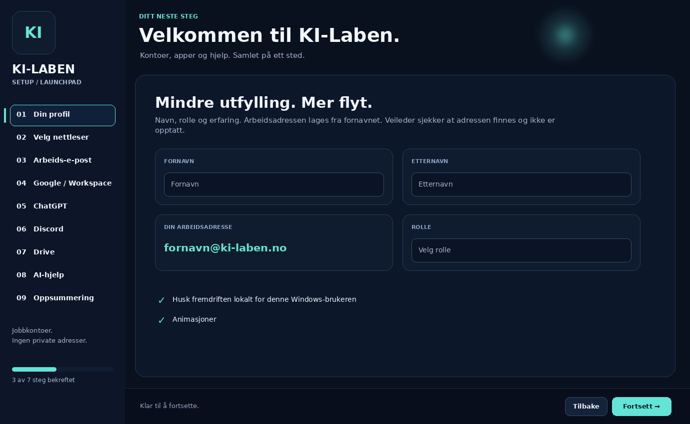

<div align="center">

# 🚀 KI-Laben Setup · Launchpad

### Første dag på KI-Laben — uten kaos.

Et moderne Windows-verktøy som samler onboarding, arbeidskontoer, nettleser, Discord, Google Workspace, ChatGPT, Drive og AI-hjelp i én guidet flyt.

[](https://github.com/Darschnid479/Setup/actions/workflows/build.yml)
[](https://github.com/Darschnid479/Setup/releases)
[](#krav)
[](https://dotnet.microsoft.com/)
[](#utvikling)


**[⚡ Kom i gang](#kom-i-gang)** · **[🖥️ Se grensesnittet](#skjermbilder)** · **[🧠 AI](#ai-hjelp)** · **[🛠️ Utvikling](#utvikling)** · **[📦 Releases](#releases)**

</div>

---

## Hva er dette?

**KI-Laben Setup** er laget for å gjøre oppstarten for nye deltakere enkel og oversiktlig. I stedet for en liste med lenker, kontoer og programmer får brukeren én veiviser med tydelige steg, status og hjelp underveis.

Målet er enkelt: **minst mulig teknisk friksjon før man kan begynne å lære og jobbe.**

### Flyten

```text
01 Din profil
      ↓
02 Velg nettleser
      ↓
03 Arbeids-e-post
      ↓
04 Google / Workspace
      ↓
05 ChatGPT
      ↓
06 Discord
      ↓
07 Drive
      ↓
08 AI-hjelp
      ↓
09 Oppsummering
```

---

## ✨ Høydepunkter

| Funksjon | Hva den gjør |
|---|---|
| 🎯 Guidet onboarding | Samler hele oppstarten i én steg-for-steg-veiviser. |
| 🌐 Nettleservalg | Oppdager og hjelper med Chrome, Firefox eller Edge. |
| 💬 Discord | Kan hente Discord-installasjonen fra leverandøren og kontrollere filen før oppstart. |
| 📧 Arbeidskonto | Bruker KI-Laben-arbeidsadressen og holder private e-postadresser utenfor flyten. |
| 🧠 AI-hjelp | Egen hjelpeside som kan kobles til KI-Labens AI-gateway. |
| 📊 Fremdrift | Viser hvor langt brukeren har kommet og kan huske lokal fremdrift. |
| ✨ Motion UI | Myke overganger, aktiv stegmarkør og moderne mørkt grensesnitt. |
| 🛡️ Sikkerhetsfokus | Ingen passord eller API-nøkler skal lagres i klientprogrammet. |
| 🧾 Oppsummering | Lager en enkel rapport over hvilke steg som er bekreftet. |

---

## 🖥️ Skjermbilder

> Bildene under er **UI-forhåndsvisninger basert på dagens WinForms-layout og fargeprofil**. Når en release er testet på Windows kan de erstattes med direkte skjermbilder fra den ferdige EXE-en.

### Start / profil



### Velg nettleser


### Discord


### AI-hjelp


---

## ⚡ Kom i gang

### For vanlige brukere

Når en ferdig release finnes, bruk **Releases** i stedet for å bygge kildekoden selv.

1. Åpne [Releases](https://github.com/Darschnid479/Setup/releases).
2. Last ned nyeste Windows-pakke.
3. Pakk ut hele mappen.
4. Start `KiLabenSetup.exe`.
5. Følg Launchpad steg for steg.

> Den publiserte Windows-versjonen bygges som self-contained. Brukeren skal derfor ikke trenge Visual Studio eller .NET SDK bare for å kjøre programmet.

### For utviklere

```bat
BYGG.bat
```

Byggeskriptet sjekker .NET 10 SDK, kjører tester, bygger WinForms-programmet og AI-gatewayen, og lager Windows-utgaven i:

```text
utgivelse\
```

---

## Krav

### Kjøre ferdig release

- Windows 10 eller Windows 11, x64
- Internett for nettbaserte onboarding-steg og nedlastinger

### Bygge kildekoden

- Visual Studio 2026
- .NET 10 SDK
- Workload: **.NET desktop development**
- Git anbefales

Se [Utviklerguiden](docs/DEVELOPMENT.md) for hele oppsettet.

---

## 🌐 Nettleser og programmer

Launchpad kan hjelpe brukeren med å velge nettleser og hente nødvendige programmer. Nedlasting og installasjon er bevisst delt i to operasjoner: brukeren får se hva som er lastet ned før installasjonen startes.

Programmet er laget rundt leverandørenes offisielle kilder og har egen signaturkontroll for nedlastede Windows-filer.

Mer informasjon: [Nedlastinger og tillit](Dokumentasjon/NEDLASTINGER.md).

---

## 🧠 AI-hjelp

Klientprogrammet inneholder en egen **AI-hjelp**-side. Selve API-nøkkelen skal aldri ligge i WinForms-klienten eller pushes til GitHub.

Arkitekturen er:

```text
┌──────────────────────────┐
│ KI-Laben Setup (WinForms)│
└────────────┬─────────────┘
             │ forespørsel
             ▼
┌──────────────────────────┐
│ KI-Laben AI Gateway      │
│ server-side secrets      │
└────────────┬─────────────┘
             │
             ▼
        AI-tjeneste
```

Klienten sender bare det brukeren eksplisitt velger å sende. Passord, engangskoder og private opplysninger skal ikke legges inn i AI-feltet.

Se [AI-drift](Dokumentasjon/AI-DRIFT.md) og [AI-arkitektur](docs/AI.md).

---

## 🏗️ Prosjektstruktur

```text
Setup/
├─ KiLabenSetup/              # WinForms-klienten (VB.NET)
├─ KiLabenAiGateway/          # Separat AI-gateway (C#)
├─ Tests/                     # Enkle logikk-/sanity-tester
├─ Dokumentasjon/             # Operativ dokumentasjon
├─ docs/                      # GitHub-dokumentasjon og skjermbilder
│  ├─ screenshots/
│  └─ assets/
├─ .github/
│  ├─ workflows/              # Automatisk build + release
│  └─ ISSUE_TEMPLATE/         # Bug / feature maler
├─ BYGG.bat                   # Lokal Windows-build
├─ global.json                # .NET 10 SDK policy
└─ README.md
```

---

## 🔄 Git-strategi

Anbefalt flyt:

```text
main ────────────────●────────●───────▶ stabile versjoner
                      \      /
dev    ●────●────●─────●────●────────▶ utvikling
        \ feature/... /
```

- `main` = fungerende og gjennomgått kode
- `dev` = aktiv utvikling
- `feature/...` = én funksjon om gangen
- tags som `v2026.2.0` = release

Se [CONTRIBUTING.md](CONTRIBUTING.md).

---

## 🤖 Automatisk build

GitHub Actions bygger prosjektet på Windows ved push og pull request.

Pipeline:

```text
Checkout
   ↓
.NET 10
   ↓
Restore
   ↓
Self-tests
   ↓
Build
   ↓
Publish Windows x64
   ↓
Upload artifact
```

Når en tag som starter med `v` pushes, kan release-workflowen lage en ZIP og publisere den som GitHub Release.

Se [Releaseguiden](docs/RELEASES.md).

---

## 🔐 Sikkerhet

**Ikke commit:**

- API-nøkler
- passord
- innloggingskoder
- tokens
- private medlemsopplysninger
- `crash.log` med sensitive opplysninger

Hvis du finner en sikkerhetsfeil, ikke legg hemmeligheter eller persondata i en offentlig issue. Se [SECURITY.md](SECURITY.md).

---

## 🗺️ Roadmap

Noen naturlige neste steg:

- [ ] ekte automatisk oppdateringssjekk mot GitHub Releases
- [ ] bedre statusdeteksjon for installerte apper
- [ ] ferdig konfigurert Discord-serverinvitasjon
- [ ] signert Windows-release
- [ ] ekte skjermbilder fra testet Windows-release
- [ ] tilgjengelighetsgjennomgang
- [ ] automatiserte UI-tester
- [ ] administratorportal for onboarding-status uten passorddata

Detaljer: [ROADMAP.md](ROADMAP.md).

---

## 🧪 Status

Prosjektet er under aktiv utvikling. Nye releases bør først regnes som klare når:

- GitHub Actions er grønn
- Windows x64-pakken er startet på en ren testmaskin
- onboarding-stegene er gjennomgått
- nedlastinger peker til forventede leverandører
- ingen nøkler eller private data ligger i repoet

---

<div align="center">

### KI-Laben Setup
**Fra ny maskin til klar for første dag.**

`Windows` · `VB.NET` · `.NET 10` · `WinForms` · `AI Gateway`

</div>
