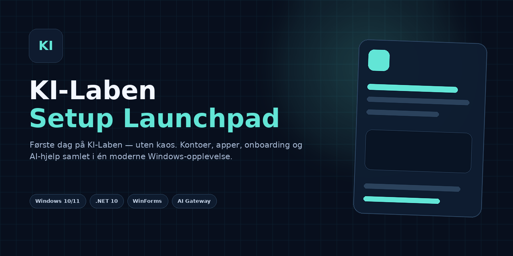
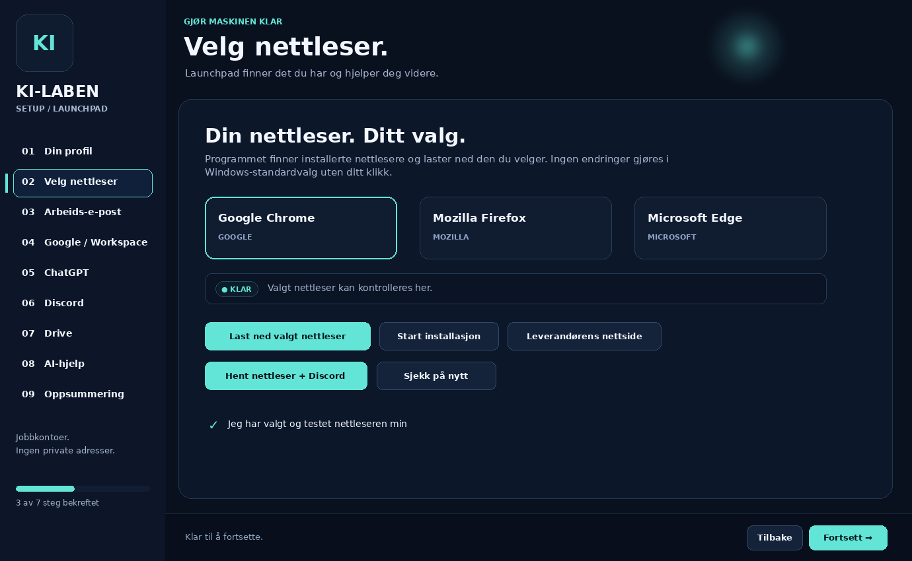
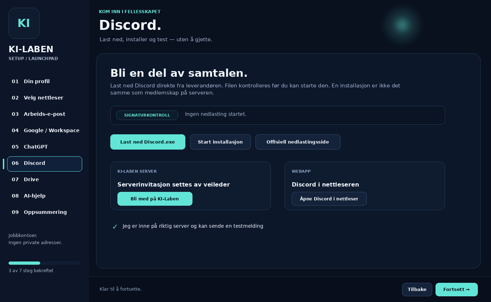
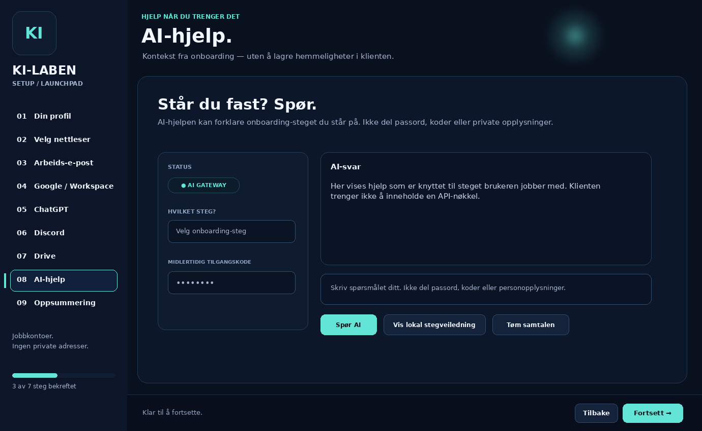

<!-- KI-LABEN-SHOWCASE-1 -->
<div align="center">

# KI-Laben Setup
### Første dag. Klar for neste steg.

Arbeidskontoer, nettleser og verktøy — samlet i én guidet Windows-opplevelse.

**[Nettside](https://Darschnid479.github.io/Setup/)** &nbsp;·&nbsp; **[Windows-utgaver](https://github.com/Darschnid479/Setup/releases)** &nbsp;·&nbsp; **[Dokumentasjon](#dokumentasjon)** &nbsp;·&nbsp; **[Tilbakemelding](https://github.com/Darschnid479/Setup/issues)**

[](https://github.com/Darschnid479/Setup/actions/workflows/launchpad-pages.yml)
[](https://github.com/Darschnid479/Setup/actions/workflows/build.yml)
[](https://github.com/Darschnid479/Setup/releases)



`Windows` &nbsp; `VB.NET / WinForms` &nbsp; `.NET 10` &nbsp; `Separat AI-gateway`

</div>

## Mindre kontokaos. Mer tid til å skape.

KI-Laben Setup samler oppstarten for nye medlemmer: profil, nettleservalg, arbeids-e-post, Google, ChatGPT, Discord, Drive og veiledning. Brukeren får én rekkefølge å følge og en oversikt over bekreftede steg.

> **Status:** Prosjektet videreutvikles. Se faktiske bygg i [Actions](https://github.com/Darschnid479/Setup/actions) og versjonsnotater i [Releases](https://github.com/Darschnid479/Setup/releases). Denne presentasjonen er ikke et bevis på at en Windows-utgave er testet eller signert.

## Et innblikk i grensesnittet

Bildene er **UI-forhåndsvisninger fra designarbeidet**, ikke verifiserte skjermbilder av en publisert EXE. Bytt dem gjerne ut med anonymiserte skjermbilder etter Windows-testing.

<table>
<tr><td width="50%"><b>01 · Din profil</b><br></td><td width="50%"><b>02 · Velg nettleser</b><br></td></tr>
<tr><td width="50%"><b>03 · Discord</b><br></td><td width="50%"><b>04 · AI-hjelp</b><br></td></tr>
</table>

**[Se større bilder og interaktivt galleri på nettsiden →](https://Darschnid479.github.io/Setup/#grensesnitt)**

## Hva Launchpad samler

| Område | Flyten i prosjektet |
|---|---|
| Arbeidskonto | `fornavn@ki-laben.no`. Ingen privat e-post i profilskjemaet. |
| Nettleser | Valg av Chrome, Firefox eller Edge, med installasjonsdeteksjon og nedlasting. |
| Google | Veiledning for eksisterende arbeidsadresse og Workspace Essentials. |
| ChatGPT | Invitasjonen hentes i Domeneshop-webmail og godtas med riktig arbeidskonto. |
| Discord | Nedlasting og veiledet oppsett. Full KI-Laben-serverinvitasjon må klargjøres. |
| Drive | Åpne arbeidsverktøy og bekreft tilgang til delte mapper. |
| AI-hjelp | Klient som kan kobles til en konfigurert AI-gateway. Ingen API-nøkkel skal bygges inn i appen. |
| Fremdrift | Lokal lagring og rapport over steg brukeren selv har bekreftet. |

**Automatisering er ikke det samme som automatisk tilgang.** Postkasser og invitasjoner må klargjøres av drifter. Innlogging, verifisering og installasjon krever fortsatt brukerens handling.

## Kom i gang

### Bruke programmet

1. Åpne [Releases](https://github.com/Darschnid479/Setup/releases) og les notatene for utgaven du velger.
2. Last ned riktig Windows-pakke når en slik fil er tilgjengelig. Ikke forveksle kildekode-ZIP med en ferdig app.
3. Pakk ut hele mappen og start `KiLabenSetup.exe`.
4. Følg stegene og bekreft at tilgangene virker.

En pakke publisert som **self-contained** trenger ikke separat .NET-runtime. Dette må stemme med byggevalgene for den konkrete releasen. Kontroller alltid kilde, utgiver og eventuelle kontrollsummer; ikke slå av Windows-sikkerhetsfunksjoner.

### Utvikle videre

```bat
git clone https://github.com/Darschnid479/Setup.git
cd Setup
BYGG.bat
```

Prosjektpakken er konfigurert for Visual Studio 2026, .NET 10 SDK og WinForms. Se gjeldende `.vbproj`, `global.json` og utviklerdokumentasjon i repoet før bygging.

## Arkitektur

```text
KI-Laben Setup / Windows Forms
    ├── Guidet oppstart og lokal fremdrift
    ├── Nettleser og programnedlastinger
    └── Valgfri AI-hjelp
             │
             ▼
      Separat AI-gateway
             │
             ▼
      Konfigurert AI-tjeneste
```

AI-serveren må driftes og konfigureres separat. Ikke legg passord, engangskoder, private medlemsdata eller API-nøkler i spørsmål, repo eller klientkonfigurasjon. GitHub Pages er kun presentasjonssiden og kjører ikke AI-serveren.

## Dokumentasjon

- [Prosjektets dokumentasjonsmappe](Dokumentasjon/)
- [GitHub- og utviklerdokumentasjon](docs/)
- [Vedlikehold av den nye nettsiden](docs/github-showcase/VEDLIKEHOLD.md)
- [Hva oppsett-BAT-en endrer](docs/github-showcase/OPPSETT.md)
- [Kilder og bildeforklaring](docs/github-showcase/KILDER.md)
- [README før presentasjonsoppgraderingen](README-before-showcase.md)

## Publisering av nettsiden

`github-site/` inneholder bare HTML, CSS, JavaScript og bilder. Workflowen **Launchpad website** publiserer denne mappen via GitHub Pages når relevante filer endres på `main`. Den bygger eller utgir **ikke** Windows-programmet.

```text
github-site/
├── index.html
├── assets/site.css
├── assets/site.js
└── assets/screenshots/

.github/workflows/launchpad-pages.yml
```

README og nettside er to ulike flater: README gir repoet en tydelig forside. Pages gir prosjektet en egen nettadresse med animasjoner, galleri og release-lenker.

## Kvalitet før en Windows-release

- Bygget i Actions må lykkes.
- Programmet må prøves på en egnet Windows-maskin.
- Logo, kontosteg, nedlasting og feilhåndtering må kontrolleres.
- AI må testes separat med faktisk gateway-oppsett.
- Logger, bilder og innstillinger må sjekkes for persondata og hemmeligheter.

Rapporter feil i [Issues](https://github.com/Darschnid479/Setup/issues) uten private opplysninger. En grønn **nettside-workflow** betyr at Pages er publisert — ikke at Windows-programmet er feilfritt.

<div align="center">

**KI-Laben Setup · Launchpad**

Et felles startpunkt. Færre løse tråder.

</div>
